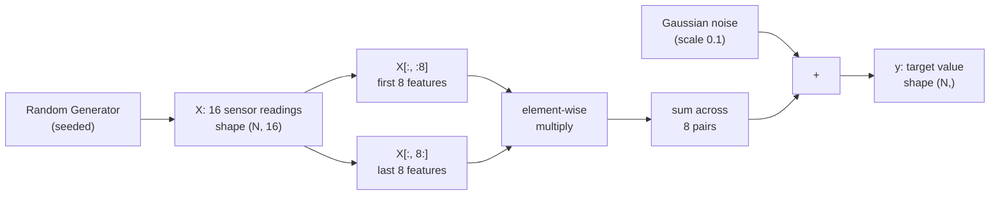
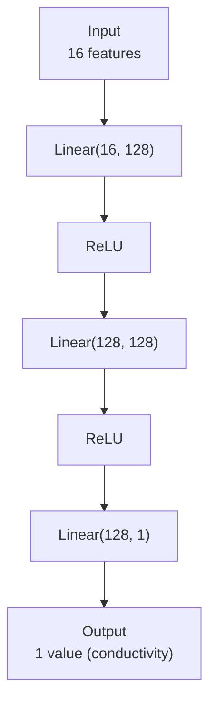
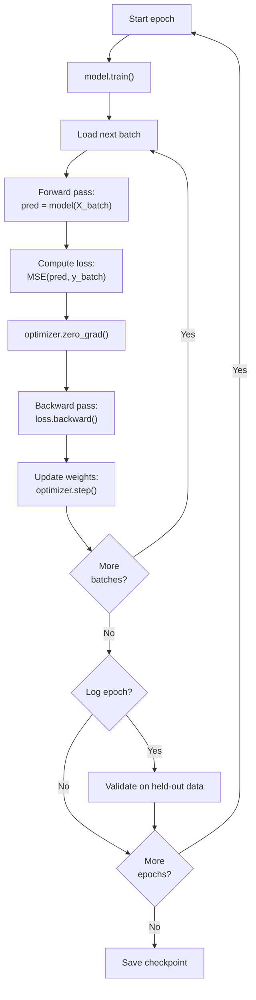
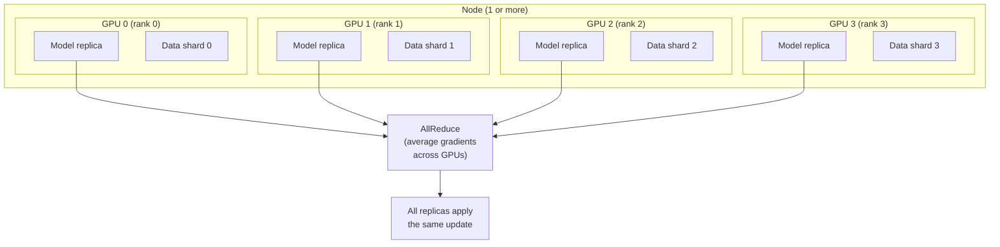
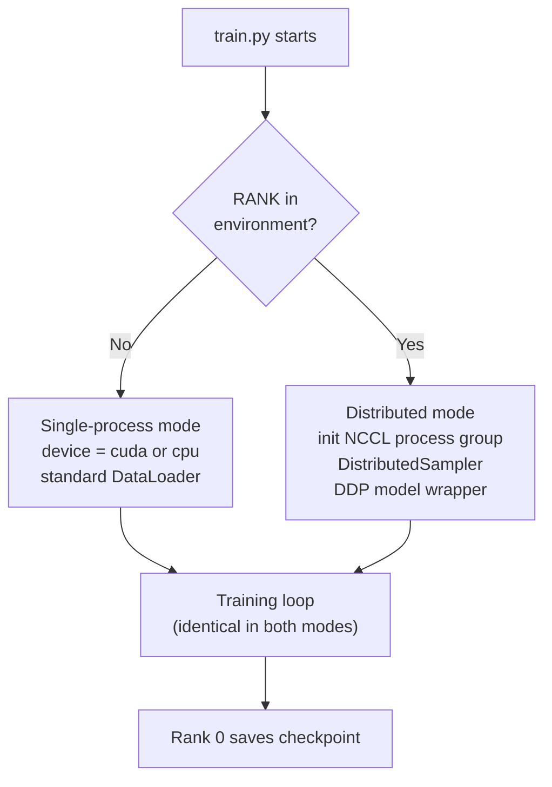

# train.py — Example Training Script

This document explains the `train.py` example used in the AICR [Running Jobs](draft-running-jobs.md) documentation. The script is designed to be self-contained: it generates its own data, trains a small neural network, and saves a checkpoint — with no external datasets, downloads, or special libraries beyond PyTorch.

## The Task

The script simulates a common scientific ML problem: **predicting a physical property from sensor measurements**. Concretely, a set of 16 sensor readings (the input features) are used to predict a material's thermal conductivity (the target value). This is a **regression** task — the model outputs a single continuous number rather than a class label.

This kind of problem appears routinely across research domains:

- Materials science: predicting mechanical or thermal properties from experimental measurements
- Climate science: estimating quantities like surface temperature from satellite sensor channels
- Engineering: mapping sensor arrays to structural health indicators

The specifics of the physics do not matter here. The point is to demonstrate training patterns that transfer to real research workloads.

## Synthetic Data Generation

Real datasets require downloads, licensing, and preprocessing. To keep the example self-contained, `make_dataset()` generates synthetic data on the fly.



The target function is:

$$
y = \sum_{i=0}^{7} x_i \cdot x_{i+8} + \varepsilon, \quad \varepsilon \sim \mathcal{N}(0, 0.01)
$$

This is a sum of **pairwise products** — nonlinear enough that a linear model cannot fit it perfectly, but simple enough that a small neural network converges in minutes. The added Gaussian noise ($\varepsilon$) prevents the model from achieving zero loss, which is realistic: real sensor data always contains measurement noise.

### Reproducibility via Seeds

The `seed` argument controls the random number generator for both data generation and weight initialization. Two runs with the same seed produce identical results. This is essential for:

- **Job arrays**: each array task gets a different seed (`--seed=$SLURM_ARRAY_TASK_ID`), producing independent experimental runs that can be compared.
- **Debugging**: a fixed seed makes failures reproducible.

PyTorch's `torch.Generator` is used for data generation so that the data seed is independent of any global random state.

**Reference**: [PyTorch Reproducibility Guide](https://pytorch.org/docs/stable/notes/randomness.html)

## Model Architecture

`SensorNet` is a fully connected feedforward network (also called a multilayer perceptron or MLP) with three linear layers and ReLU activations.



### Layer-by-Layer

| Layer | Input Dim | Output Dim | Parameters | Purpose |
|-------|-----------|------------|------------|---------|
| `Linear(16, 128)` | 16 | 128 | 2,176 | Project sensor readings into a higher-dimensional representation |
| `ReLU` | 128 | 128 | 0 | Introduce nonlinearity so the network can learn nonlinear relationships |
| `Linear(128, 128)` | 128 | 128 | 16,512 | Learn combinations of the intermediate features |
| `ReLU` | 128 | 128 | 0 | Second nonlinearity |
| `Linear(128, 1)` | 128 | 1 | 129 | Collapse to a single scalar prediction |
| **Total** | | | **18,817** | |

The model is intentionally small (~19K parameters). It trains in seconds on a GPU and minutes on a CPU, making it practical as a documentation example that users can actually run to verify their cluster setup.

### Why ReLU?

[ReLU](https://pytorch.org/docs/stable/generated/torch.nn.ReLU.html) (Rectified Linear Unit) outputs `max(0, x)`. It is the default activation in most modern networks because it is computationally cheap and avoids the vanishing gradient problem that affects sigmoid and tanh activations in deep networks.

**Reference**: [PyTorch nn.Sequential](https://pytorch.org/docs/stable/generated/torch.nn.Sequential.html) — how the layers are composed

## The Training Loop

The training loop follows the standard PyTorch pattern. Every deep learning training script — from a 19K-parameter MLP to a billion-parameter language model — uses this same structure.



### Step-by-Step

1. **Forward pass** — The input batch passes through the network to produce predictions. PyTorch records every operation in a computational graph for later use in backpropagation.

2. **Loss computation** — [MSELoss](https://pytorch.org/docs/stable/generated/torch.nn.MSELoss.html) (Mean Squared Error) measures the average squared difference between predictions and targets. For regression, MSE is the standard starting point.

3. **Zero gradients** — `optimizer.zero_grad()` clears gradients accumulated from the previous batch. Without this step, gradients would accumulate across batches and the updates would be wrong.

4. **Backward pass** — `loss.backward()` computes the gradient of the loss with respect to every model parameter by walking the computational graph in reverse (backpropagation).

5. **Weight update** — `optimizer.step()` adjusts each parameter in the direction that reduces the loss. The [Adam](https://pytorch.org/docs/stable/generated/torch.optim.Adam.html) optimizer adapts the learning rate per parameter, which generally converges faster than plain stochastic gradient descent (SGD) on problems like this.

### Validation

Every `--log-every` epochs (default 5), the script evaluates the model on a held-out validation set. This serves two purposes:

- **Detect overfitting**: if training loss decreases but validation loss increases, the model is memorizing the training data rather than learning generalizable patterns.
- **Monitor convergence**: when validation loss stops decreasing, training can be stopped.

Validation runs inside `torch.no_grad()` to disable gradient tracking, which saves memory and computation.

**References**:
- [PyTorch Training Tutorial](https://pytorch.org/tutorials/beginner/basics/optimization_tutorial.html) — the canonical introduction to the training loop
- [Goodfellow et al., Deep Learning, Chapter 8](https://www.deeplearningbook.org/contents/optimization.html) — mathematical foundations of optimization

## Distributed Training (DDP)

The script supports multi-GPU and multi-node training via PyTorch's [DistributedDataParallel](https://pytorch.org/docs/stable/generated/torch.nn.parallel.DistributedDataParallel.html) (DDP). This is the standard approach for scaling training beyond a single GPU.

### How DDP Works



Each GPU holds a **complete copy** of the model and processes a different slice of the training data. After the backward pass, an [AllReduce](https://pytorch.org/docs/stable/distributed.html#torch.distributed.all_reduce) operation averages the gradients across all GPUs. Every replica then applies the same weight update, keeping the models in sync.

### Key Implementation Details in train.py

| Concern | How the script handles it |
|---------|--------------------------|
| **Detection** | Checks for the `RANK` environment variable, which `torchrun` sets automatically |
| **Process group** | `init_process_group(backend="nccl")` — NCCL is optimized for NVIDIA GPU-to-GPU communication over NVLink and InfiniBand |
| **Device assignment** | `torch.cuda.set_device(local_rank)` pins each process to its own GPU |
| **Data sharding** | `DistributedSampler` splits the dataset so each GPU sees a unique subset per epoch |
| **Epoch shuffling** | `train_sampler.set_epoch(epoch)` re-shuffles the shards each epoch to avoid repeating the same split |
| **Model wrapping** | `DistributedDataParallel(model, device_ids=[local_rank])` adds the gradient synchronization hooks |
| **Checkpoint saving** | Only rank 0 saves, using `model.module.state_dict()` to unwrap the DDP wrapper |
| **Cleanup** | `destroy_process_group()` releases NCCL resources when training finishes |

### Single GPU vs. Multi-GPU: What Changes

The script is written so that the same file works in both modes with no code changes:



When launched with `python train.py`, no distributed environment variables exist, so it falls through to single-GPU (or CPU) mode. When launched with `torchrun`, the environment variables are set and the distributed code path activates.

**References**:
- [PyTorch DDP Tutorial](https://pytorch.org/tutorials/intermediate/ddp_tutorial.html) — step-by-step guide to distributed training
- [PyTorch torchrun Documentation](https://pytorch.org/docs/stable/elastic/run.html) — how `torchrun` sets up the process group
- [NCCL Documentation](https://docs.nvidia.com/deeplearning/nccl/user-guide/docs/index.html) — the GPU communication library used by DDP

## Data Loading

Efficient data loading prevents the GPU from sitting idle while waiting for the next batch.

| Setting | Value | Why |
|---------|-------|-----|
| `batch_size` | 256 (default) | Large enough to utilize GPU parallelism, small enough to fit in memory |
| `num_workers` | 2 | Background processes prepare batches while the GPU trains on the current one |
| `pin_memory` | True | Allocates CPU tensors in page-locked memory, speeding up the CPU-to-GPU transfer |
| `shuffle` | True (single GPU) | Randomizes batch composition each epoch to reduce overfitting |
| `sampler` | DistributedSampler (DDP) | Replaces shuffle — each GPU gets a unique, non-overlapping subset |

**Reference**: [PyTorch DataLoader](https://pytorch.org/docs/stable/data.html#torch.utils.data.DataLoader) — full parameter documentation

## Checkpointing

After training, rank 0 saves a checkpoint containing the model weights and the final epoch number:

```python
torch.save({"epoch": args.epochs, "model_state_dict": state}, ckpt_path)
```

The filename includes the seed (`checkpoint_seed0.pt`, `checkpoint_seed42.pt`, etc.) so that job array runs produce distinct files rather than overwriting each other.

To load a checkpoint later:

```python
checkpoint = torch.load("checkpoint_seed0.pt")
model = SensorNet()
model.load_state_dict(checkpoint["model_state_dict"])
```

**Reference**: [PyTorch Save/Load Guide](https://pytorch.org/tutorials/beginner/saving_loading_models.html)

## Command-Line Arguments

| Argument | Default | Description |
|----------|---------|-------------|
| `--seed` | 0 | Random seed for data generation and weight initialization |
| `--epochs` | 20 | Number of full passes through the training data |
| `--batch-size` | 256 | Samples per batch per GPU |
| `--lr` | 0.001 | Adam learning rate |
| `--train-samples` | 50,000 | Number of synthetic training examples |
| `--val-samples` | 10,000 | Number of synthetic validation examples |
| `--log-every` | 5 | Print training and validation loss every N epochs |
| `--output-dir` | `.` | Directory for saved checkpoints |

## Running on AICR

The script works directly with the Slurm job scripts in the [Running Jobs](draft-running-jobs.md) documentation.

### Single GPU

```bash
#!/bin/bash
#SBATCH --partition=rtx-batch
#SBATCH --gpus=1
#SBATCH --time=00:15:00
#SBATCH --account=ACCOUNT_NAME

module purge
module load cuda
python train.py --epochs=20
```

### Multi-GPU (Single Node)

```bash
#!/bin/bash
#SBATCH --partition=b200-batch
#SBATCH --gpus-per-node=4
#SBATCH --cpus-per-task=32
#SBATCH --time=00:15:00
#SBATCH --account=ACCOUNT_NAME

module purge
module load cuda
torchrun --nproc_per_node=4 train.py --epochs=20
```

### Job Array (Parameter Sweep)

```bash
#!/bin/bash
#SBATCH --partition=rtx-batch
#SBATCH --gpus=1
#SBATCH --array=0-9
#SBATCH --time=00:15:00
#SBATCH --account=ACCOUNT_NAME

module purge
module load cuda
python train.py --seed=$SLURM_ARRAY_TASK_ID --output-dir=results
```

This produces 10 checkpoints (`results/checkpoint_seed0.pt` through `results/checkpoint_seed9.pt`), one per array task.

## Further Reading

### PyTorch

- [PyTorch Tutorials](https://pytorch.org/tutorials/) — official tutorial collection, from basics to advanced
- [Autograd Mechanics](https://pytorch.org/docs/stable/notes/autograd.html) — how `loss.backward()` computes gradients
- [CUDA Semantics](https://pytorch.org/docs/stable/notes/cuda.html) — GPU memory management, streams, and device selection
- [DDP Best Practices](https://pytorch.org/tutorials/intermediate/ddp_tutorial.html) — writing efficient distributed code
- [Performance Tuning Guide](https://pytorch.org/tutorials/recipes/recipes/tuning_guide.html) — data loading, mixed precision, and profiling

### Machine Learning Foundations

- [Goodfellow, Bengio, Courville — Deep Learning](https://www.deeplearningbook.org/) — comprehensive textbook covering the theory behind neural networks, optimization, and regularization (free online)
- [Andrej Karpathy — Neural Networks: Zero to Hero](https://karpathy.ai/zero-to-hero.html) — video lecture series building neural networks from scratch
- [Stanford CS231n](https://cs231n.stanford.edu/) — convolutional neural networks for visual recognition, with excellent notes on backpropagation and optimization
- [fast.ai Practical Deep Learning](https://course.fast.ai/) — top-down, code-first introduction to deep learning

### Distributed Training

- [PyTorch Distributed Overview](https://pytorch.org/tutorials/beginner/dist_overview.html) — comparison of DDP, FSDP, and other parallelism strategies
- [NVIDIA NCCL](https://docs.nvidia.com/deeplearning/nccl/user-guide/docs/index.html) — the collective communication library that DDP uses on NVIDIA GPUs
- [Distributed Training with Slurm](https://pytorch.org/tutorials/intermediate/ddp_series_multinode.html) — PyTorch's guide to multi-node training on Slurm clusters
