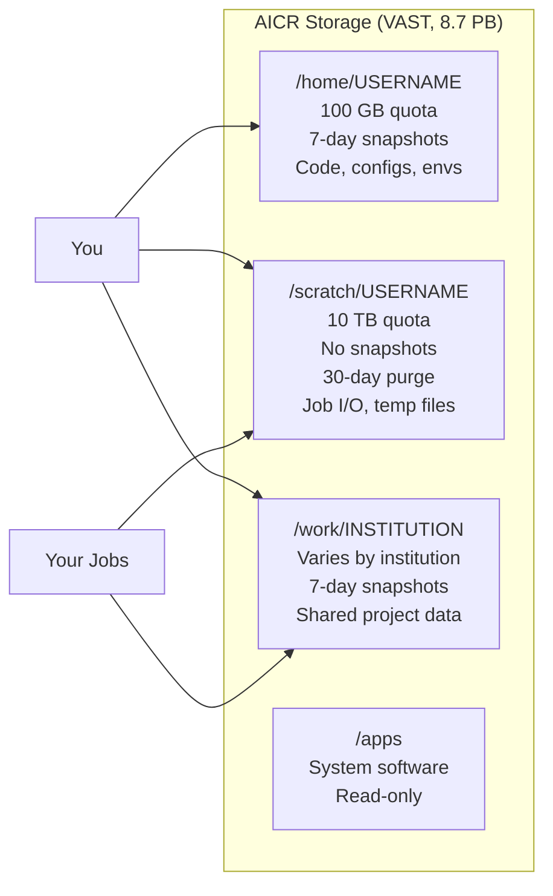

# Filesystem Overview

AICR provides fast, all-flash storage for your research data. Every user has a personal **Home** directory and a **Scratch** directory, and every project has access to shared **Work** storage for their institution. This page explains what each storage area is for, how much space you have, and how to keep your data safe.

!!! warning "AICR storage is not backed up"
    All storage on AICR relies on **snapshots only** — there are no off-site backups. Files that cannot be easily replaced (source code, irreplaceable datasets, manuscripts) should be backed up to an external location such as your institution's storage service, cloud storage, or a version control system like GitHub.

## Storage Areas at a Glance

| Storage | Path | Quota | Snapshots | Purge Policy | Best For |
|---------|------|-------|-----------|--------------|----------|
| Home | `/home/USERNAME` | 100 GB | 7-day | None | Code, configs, small datasets, software environments |
| Scratch | `/scratch/USERNAME` | 10 TB | None | 30 days | Temporary job I/O, large intermediate files, checkpoints |
| Work | `/work/INSTITUTION` | Varies | 7-day | None | Shared project data, collaboration within your institution |
| Apps | `/apps` | Shared | — | — | System-wide software (read-only for users) |

## Home Directory

**Path**: `/home/USERNAME` (also accessible as `~` or `$HOME`)

Your home directory is for files you want to keep: source code, configuration files, small scripts, Conda environments, and SSH keys. It has a **100 GB quota** and **7-day snapshots** for accidental deletion recovery.

```bash
$ df -h ~
```

!!! tip
    Keep your home directory lean. Large datasets, container images (`.sif` files), and job output belong in scratch or work storage. If your home directory fills up, jobs that write to `~` will fail.

### What to store in Home

- Source code and scripts
- Conda and pip virtual environments (if small)
- Configuration files (`.bashrc`, Jupyter configs)
- SSH keys and certificates

### What NOT to store in Home

- Large datasets (use scratch or work)
- Container images (use scratch)
- Job output files (write to scratch, copy important results to work)

## Scratch

**Path**: `/scratch/USERNAME`

Scratch is high-capacity temporary storage for active computation. Use it for job input data, intermediate results, and output files. It has a **10 TB quota** but **no snapshots and no backups**.

!!! warning "30-day purge policy"
    Files on scratch that have not been accessed for **30 days are automatically deleted**. Do not use scratch for long-term storage. Copy important results to your work directory or off-cluster when your project reaches a milestone.

<!-- TODO: verify that automated 30-day purge is active — technotes show protection policy exists but purge automation details not confirmed in VAST config -->

```bash
$ ls /scratch/$USER/
```

### Typical scratch workflow

1. Stage input data to scratch before submitting a job.
2. Point your job script's output to scratch.
3. When the job completes, copy results you need to keep to `/work/INSTITUTION` or off-cluster.
4. Delete files you no longer need — do not wait for the purge.

```bash
# Copy results to work storage after a job finishes
$ cp /scratch/$USER/experiment_results.tar.gz /work/INSTITUTION/projects/my_project/
```

## Work

**Path**: `/work/INSTITUTION`

Work storage is shared space for your institution's research groups. It is the right place for datasets, shared code, and results that multiple team members need to access. It has **7-day snapshots** and no purge policy, but should be cleaned up when a project ends.

Each institution has its own work directory:

| Institution | Work Path |
|-------------|-----------|
| Boston University | `/work/bu` |
| Harvard University | `/work/hu` |
| MIT | `/work/mit` |
| Northeastern University | `/work/neu` |
| UMass Amherst | `/work/umass/umass` |
| UMass Boston | `/work/umass/umb` |
| UMass Dartmouth | `/work/umass/umassd` |
| UMass Lowell | `/work/umass/uml` |
| UMass Medical | `/work/umass/umassmed` |
| Yale University | `/work/yale` |

!!! note
    Work directory quotas vary by institution. If you need more space, contact your institution's research computing team or [AICR support](../help.md).

### Organizing work storage

A clear directory structure helps your collaborators find files. Consider organizing by project:

```
/work/mit/
    project-alpha/
        data/
        scripts/
        results/
    project-beta/
        ...
```

## Checking Your Quota

### Home and Scratch

Check your home directory usage:

```bash
$ df -h ~
```

Check your scratch usage:

```bash
$ du -sh /scratch/$USER
```

<!-- TODO: verify whether a dedicated quota command (e.g., quota -s, lfs quota, or vast-specific tool) is available to users -->

### Finding large files

If you are running low on space, find your largest files:

```bash
$ du -ah /scratch/$USER | sort -rh | head -20
```

!!! tip
    The `ncdu` utility provides an interactive, navigable view of disk usage. If it is available, run `ncdu /scratch/$USER` for a faster way to identify large files and directories.

## Snapshots

Home and work directories have **7-day rolling snapshots**. Snapshots are read-only point-in-time copies of your files. They protect against accidental deletion or overwriting — they are **not a substitute for backups**.

### Restoring a file from a snapshot

Snapshots are accessible through a hidden `.snapshot` directory at the root of the filesystem:

```bash
# List available snapshots
$ ls /home/$USER/.snapshot/

# View the contents of a snapshot
$ ls /home/$USER/.snapshot/SNAPSHOT_NAME/

# Restore a deleted file
$ cp /home/$USER/.snapshot/SNAPSHOT_NAME/path/to/file ~/path/to/file
```

<!-- TODO: verify exact snapshot directory path and naming convention on VAST (.snapshot vs .snapshots, and snapshot name format) -->

!!! warning
    Snapshots are retained for 7 days only. If you deleted a file more than 7 days ago, it cannot be recovered from snapshots. Back up irreplaceable files externally.

## Storage Performance

All AICR storage is served by a VAST Data all-flash system over **NFS-RDMA on InfiniBand** (NDR400, 400 Gb/s). This means:

- **High throughput**: Large sequential reads and writes (e.g., loading training data, writing checkpoints) benefit from 16 parallel RDMA connections per mount.
- **Low latency**: Metadata operations (listing directories, opening files) are fast because InfiniBand RDMA bypasses the kernel network stack.
- **Encryption at rest**: All data is encrypted with AES-256-XTS on the storage system. This is transparent — you do not need to do anything to enable it.

!!! info
    You do not need to configure anything to benefit from RDMA. The filesystems are mounted with optimized settings automatically. If you are benchmarking I/O performance and see lower-than-expected numbers, contact [AICR support](../help.md).

## Data Management Best Practices

### Keep scratch clean

Do not let files accumulate on scratch. After each batch of jobs:

1. Review the output in `/scratch/USERNAME`.
2. Copy important results to work storage or off-cluster.
3. Delete intermediate files.

### Use version control for code

Store code in a Git repository (GitHub, GitLab, or similar) rather than relying on cluster storage as the primary copy. This protects against accidental deletion and makes collaboration easier.

### Stage large datasets deliberately

If your workflow requires a large dataset:

1. Transfer it to `/scratch/USERNAME` before submitting jobs (see [Transferring Data](transferring-data.md)).
2. Reference it by absolute path in your job scripts.
3. Avoid storing multiple copies — symlink if needed.

### Do not store sensitive data without authorization

AICR storage is encrypted at rest, but access controls are based on POSIX file permissions. If your research involves sensitive data (HIPAA, FERPA, export-controlled), contact [AICR support](../help.md) before storing it on the cluster.

## Summary



## See Also

- [Transferring Data](transferring-data.md) — moving data to and from AICR with Globus, scp, and rsync
- [Running Jobs](../running-jobs.md) — how to point your jobs at the right storage
- [Getting Started](../getting-started.md) — first steps including filesystem orientation
- [Recipes: Restoring from Snapshots](../recipes/snapshots.md) — detailed snapshot recovery walkthrough
